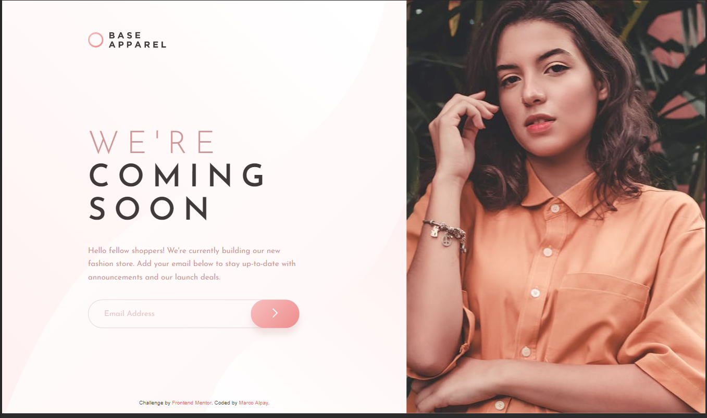

# Frontend Mentor - Base Apparel coming soon page solution

This is a solution to the [Base Apparel coming soon page challenge on Frontend Mentor](https://www.frontendmentor.io/challenges/base-apparel-coming-soon-page-5d46b47f8db8a7063f9331a0). Frontend Mentor challenges help you improve your coding skills by building realistic projects.

## Table of contents

- [Overview](#overview)
  - [The challenge](#the-challenge)
  - [Screenshot](#screenshot)
  - [Links](#links)
- [My process](#my-process)
  - [Built with](#built-with)
  - [What I learned](#what-i-learned)
- [Author](#author)

## Overview

### The challenge

Users should be able to:

- View the optimal layout for the site depending on their device's screen size
- See hover states for all interactive elements on the page
- Receive an error message when the `form` is submitted if:
  - The `input` field is empty
  - The email address is not formatted correctly

### Screenshot




### Links

- Solution URL: [https://www.frontendmentor.io/solutions/base-apparel-using-sass-and-javascript-9rxFPX3wK](https://www.frontendmentor.io/solutions/base-apparel-using-sass-and-javascript-9rxFPX3wK)
- Live Site URL: [https://devmarco02-apparel-coming-soon.netlify.app/](https://devmarco02-apparel-coming-soon.netlify.app/)

## My process

### Built with

- Semantic HTML5 markup
- Sass
- Flexbox
- CSS Grid
- Mobile-first workflow
- BEM methodology

### What I learned

I have learned how to use gradient as background image.

```css
background-image: url(/images/bg-pattern-desktop.svg), linear-gradient(135deg, var(--first-from), var(--first-to));
```

I also learned how to validate email address using Regex.

```js
const mailFormat =
  /^(([^<>()[\]\\.,;:\s@"]+(\.[^<>()[\]\\.,;:\s@"]+)*)|(".+"))@((\[[0-9]{1,3}\.[0-9]{1,3}\.[0-9]{1,3}\.[0-9]{1,3}\])|(([a-zA-Z\-0-9]+\.)+[a-zA-Z]{2,}))$/;

  if (emailValue === "") {
    setError("Email cannot be blank");
  } else if (!emailValue.match(mailFormat)) {
    setError("Please provide a valid email");
  } else {
    setSuccess();
  }
};
```

## Author

- Frontend Mentor - [@devMarco02](https://www.frontendmentor.io/profile/devMarco02)
